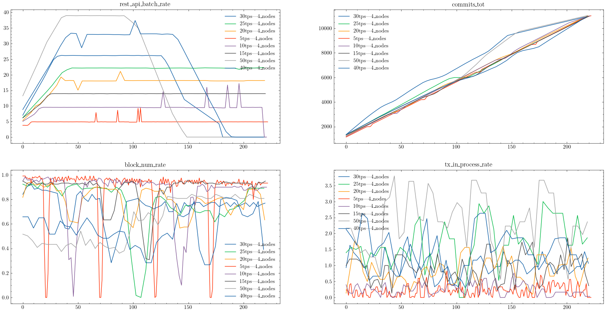
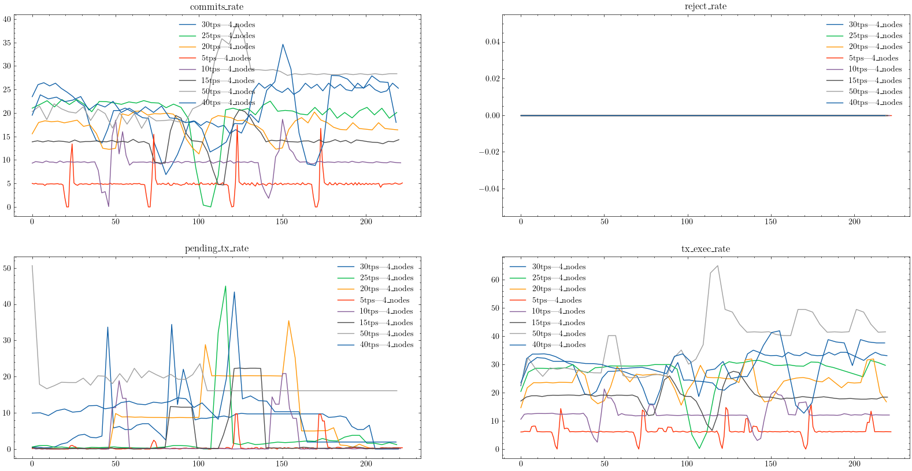
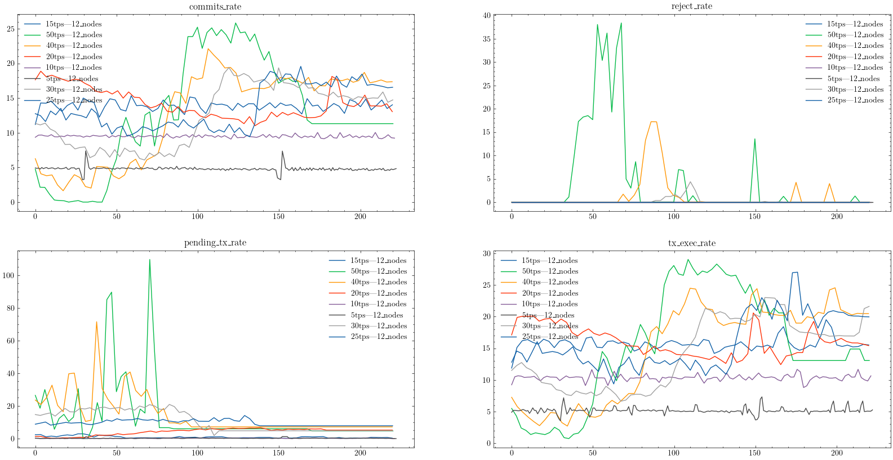
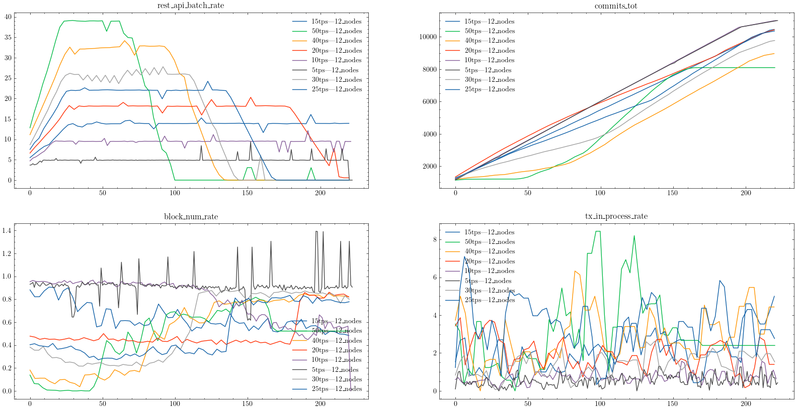
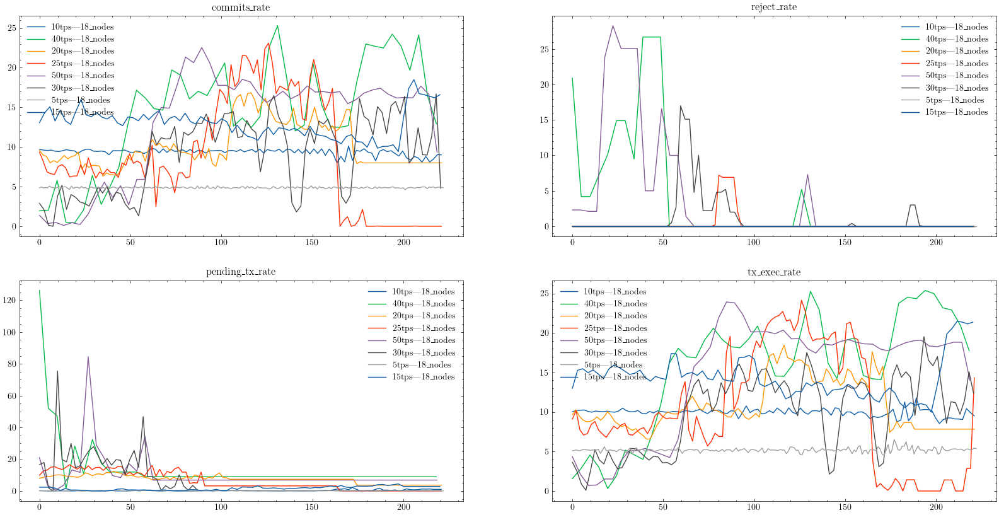
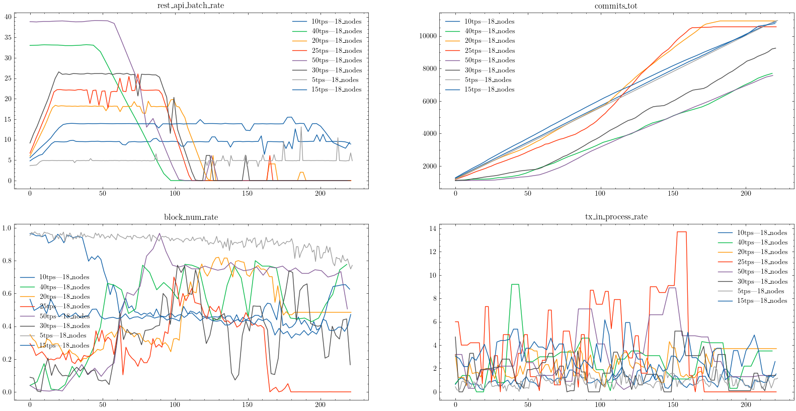
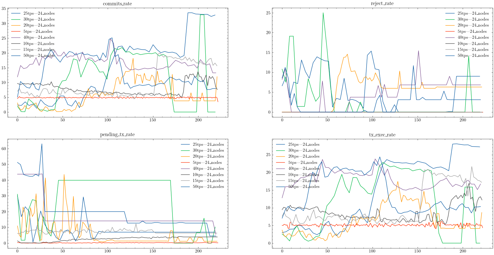
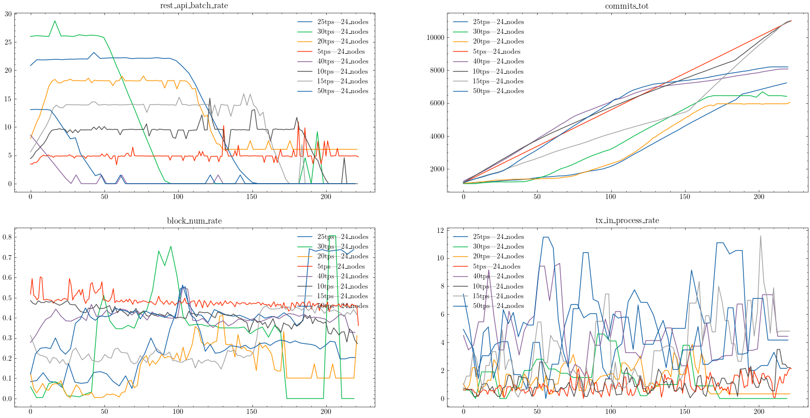

# A Blockchain cloud architecture deployment for an industrial IoT use-case
## Repository Structure

The repository contains the project results data, stuctured as follow:

   - `./data_csv/`: folder contains csv files from benchmark tests for all Sawtooth networks tested (4 nodes, 6 nodes, 12 nodes, 18 nodes, 24 nodes)
   - `export_influx_data.sh`: bash script used to extract data from influx data base that stored blockchain metrics. Run the script as follow
```bash
./export_influx_data.sh start_time_stamp stop_time_stamp
```
   Provide two parameters to the script: data start and stop timestamps. Extracted data are saved in directory named `./datas/`.

   - `build_data.py`: python script used to process data extracted in the previous step. Run the script as follow
```bash
./build_data.py test_name
```
   Provide one parameter to the script: test_name, files from `./datas/` repository. processed data are stored in `./data_csv repository/`

   - `display_merged_data.py`: python script used to display processed data in the previous step
```bash
./display_merged_data.py 
```
The following images show data displaying for each Sawtooth network tested
## 4 nodes results
    
 



## 6 nodes results
    
 


## 12 nodes results
    
 



## 18 nodes results 
 


## 24 nodes results
 


